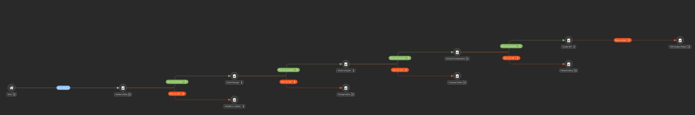

# public-cloud-mockup

Simple set of playbooks to mock up a VM creation on a private cloud, simulating storage, compute and network capacities verification and allocation.

## Directory Structure
├── master_provisioning_workflow.yml
├── playbooks
│   ├── 00_setup_vars.yml
│   ├── 01_check_storage.yml
│   ├── 02_check_compute.yml
│   ├── 03_provision_network.yml
│   ├── 04_create_vm.yml
│   ├── 99_failure_report.yml
│   ├── test.yml
│   └── Untitled-1.yml
├── README.md
├── tasks
│   ├── 00_setup_vars.yml
│   ├── 01_check_storage.yml
│   ├── 01_create_vm.yml
│   ├── 02_check_compute.yml
│   └── 03_provision_network.yml
└── vars
    ├── capacity_profiles.yml
    └── vm_config.yml

## Execution
This mockup is aimed to be executed both on the cli as well as on a workflow on AAP.

### Command Line
If you want to run it from the command line, populate the variables file under vars/vm_config bearing in midn the variable structure defined on var/capacity_profile.yml file.

Run it as
```
$ ansible-navigator run master_provisioning_workflow.yml
```
### As an AAP Workflow
Create a workflow 
